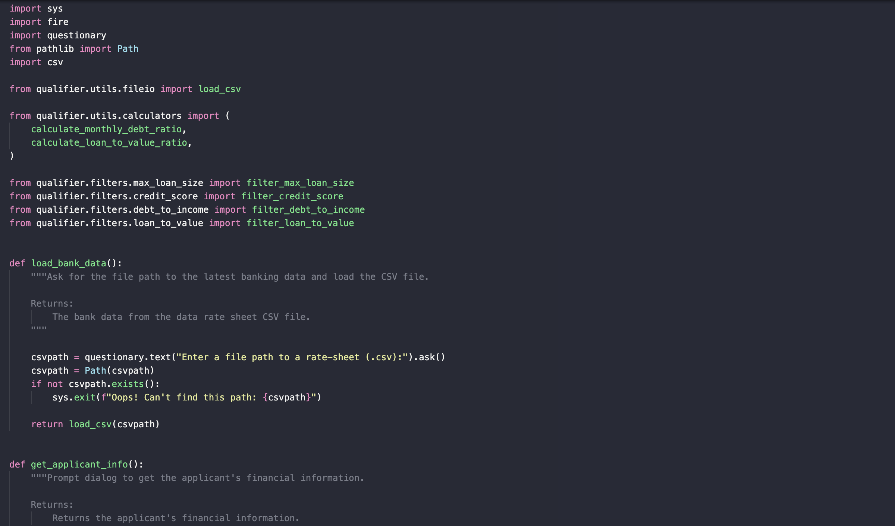
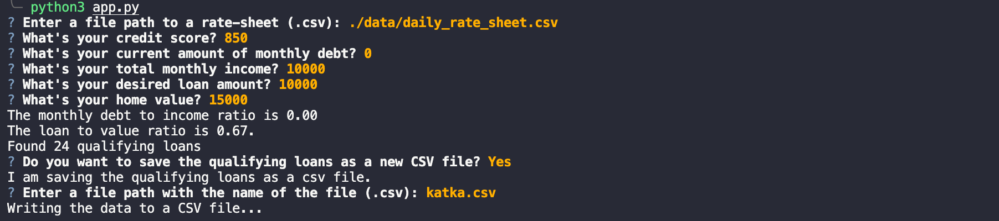

# *LOAN QUALIFIER REPOSITORY*
---

**Welcome to my repository of Loan qualifier project. Please explore the codebase!** <br />

>"If you control the code, you control the world. This is the future that awaits us." Marc Goodman
---



---

## Technologies

This project leverages python 3.7 with the following packages:

* [fire](https://github.com/google/python-fire) - For the command line interface, help page, and entry-point.

* [questionary](https://github.com/tmbo/questionary) - For interactive user prompts and dialogs

* [pathlib](https://github.com/python/cpython/blob/3.10/Lib/pathlib.py) -  Instantiates a concrete path for the platform the code is running on.

* [csv](https://github.com/python/cpython/blob/3.10/Lib/csv.py) - Implements classes to read and write tabular data in CSV format. 
* [sys](https://docs.python.org/3/library/sys.html) - This module provides access to some variables used or maintained by the interpreter and to functions that interact strongly with the interpreter.
---

## Installation Guide

Before running the application first install the following dependencies.

```python
  pip install fire
  pip install questionary
  pip install pathlib
  pip install csv
  pip install sys
```

---

## Usage

To use the loan application simply clone the repository and run the **app.py**:

```python
python app.py
```

Upon launching the loan script you will be asked to answer the following questions:



---

---

## Contributors

Brought to you by Katerina Gawthorpe.

---

## License

MIT